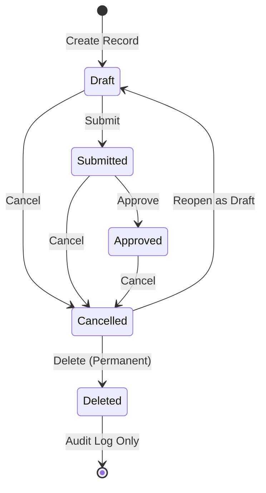

# DoersOS Module System — Default Record Workflow Specification

## 1. Overview & Principles

DoersOS implements an entity-agnostic standard record lifecycle across all schema-driven entities (`modules/*/schema.json`). This ensures uniform governance, deterministic audit logging, and consistent user experience across every business application in the platform.

---

## 2. Standard State Machine

Every entity record traverses a predefined sequence of 5 distinct states:



---

## 3. Detailed Status Definitions & Transitions

| Current Status | Allowed Next Statuses | Primary Forward Action | Dropdown / Side Actions | Editable? | Deletable? |
| :--- | :--- | :--- | :--- | :---: | :---: |
| **`Draft`** | `Submitted`, `Cancelled` | **Submit** (`submitted`) | **Cancel** (`cancelled`) | Yes | ❌ No (Must cancel first) |
| **`Submitted`** | `Approved`, `Cancelled` | **Approve** (`approved`) | **Cancel** (`cancelled`) | Yes | ❌ No (Must cancel first) |
| **`Approved`** | `Cancelled` | — | **Cancel** (`cancelled`) | No | ❌ No (Must cancel first) |
| **`Cancelled`** | `Draft`, `Deleted` | **Reopen as Draft** (`draft`) | **Delete** (`deleted`) | No | ✅ Yes (Only when cancelled) |
| **`Deleted`** | *(Terminal State)* | — | *(None — retained in audit log)* | No | ❌ Terminal |

---

## 4. Business & Governance Rules

1. **Delete Protection**:
   - A record can **NEVER** be deleted directly from `Draft`, `Submitted`, or `Approved` states.
   - Users **must cancel the record first** before the `Delete` action becomes available.
   - This prevents accidental data loss and ensures an explicit cancellation audit record exists before purge.

2. **Reopening Cancelled Records**:
   - Cancelled records may be reopened back into `Draft` status via **Reopen as Draft**.
   - Once back in `Draft`, the record can be edited and resubmitted into the workflow.

3. **Approved Records**:
   - Approved records represent finalized, active business transactions and are **read-only**.
   - If an approved record must be voided or revoked, it must transition to **`Cancelled`**.

4. **Deleted Status**:
   - Records marked as `Deleted` are soft-deleted from standard queries (`record_status != 'deleted'`).
   - Deleted records remain accessible exclusively within the system **Audit Logs** (`system.audit_logs`).

---

## 5. UI Layout Standard for Record View

The Record View header strictly follows this layout:

- **Left Side**:
  - `[ ← ]` **Back Button**: Minimalist arrow icon button with no text.
  - `[ ✎ ]` **Edit Button**: Placed immediately to the right of the Back arrow, icon-only (`Pencil`). Visible only when the record status allows edits (`Draft`, `Submitted`).
- **Right Side**:
  - **Status Badge**: Displays current state (`draft`, `submitted`, `approved`, `cancelled`).
  - **Action Split Button with Dropdown**:
    - **Main Action**: Primary forward step (e.g. `[ Submit ]`, `[ Approve ]`, `[ Reopen as Draft ]`).
    - **Chevron Dropdown `[ ⌄ ]`**: Reveals secondary actions (e.g. `Cancel` or `Delete`).

---

## 6. Backend Authority & Enforcement

The state machine is strictly enforced by the backend in `backend/src/core/entity-engine/entity-repository.service.ts`:

```typescript
const ALLOWED_TRANSITIONS: Record<RecordStatus, RecordStatus[]> = {
  draft: ['submitted', 'cancelled'],
  submitted: ['approved', 'cancelled'],
  approved: ['cancelled'],
  cancelled: ['draft', 'deleted'],
  deleted: [],
};
```

Any attempt to perform an unauthorized transition (e.g., direct deletion of a `draft` or `submitted` record) is rejected with `HTTP 400 Bad Request: Cannot transition from "<current>" to "<target>"`.
